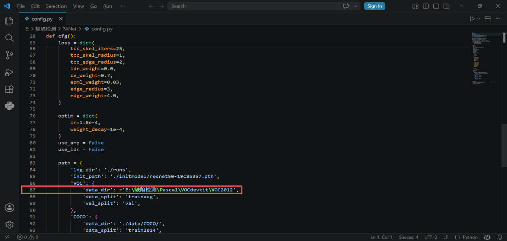
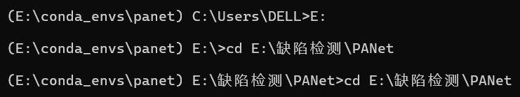
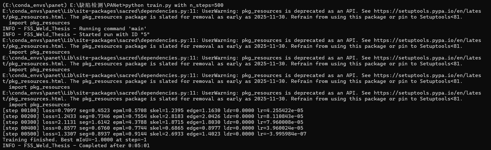
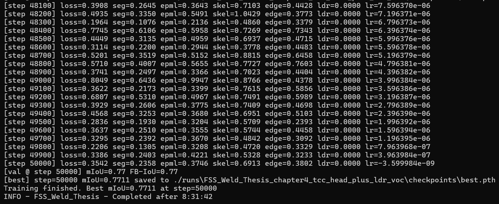
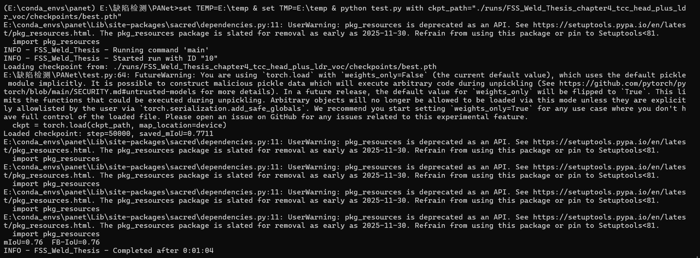
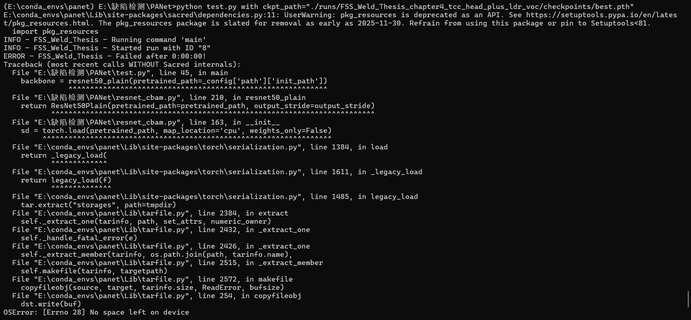

<h1 align="center">PANet说明书</h1>

## 一、项目概述

本项目基于 PANet（Prototype Alignment Network），实现少样本（Few-Shot）的缺陷检测与语义分割，支持Pascal VOC 2012数据集。

项目代码(含项目运行必须的与训练权重模型文件版)链接

https://pan.baidu.com/s/14eW02kU0o1aRzK7rmJ1qFA?pwd=ej4a 提取码: ej4a

数据集链接

https://pan.baidu.com/s/1ZuxBb0Z4BMIuHVRQQHBjig?pwd=yhvv 提取码: yhvv

项目目录结构如下：

| 文件/目录 | 说明 |
| --- | --- |
| train.py | 训练入口 |
| test.py | 测试入口，加载模型权重并评估测试集 mIoU |
| config.py | 实验配置（数据集路径、超参数、模型参数） |
| dpanet_pml.py | 核心模型文件（DPANet + PML + TCC-Head） |
| resnet_cbam.py | 带CBAM注意力模块的ResNet骨干网络 |
| spm.py | SPM（Strip Pooling Module）模块 |
| pml_loss.py | PML（Prototype Metric Learning）损失函数 |
| PPIE.py | 原型交互/增强模块 |
| dataloaders/ | 数据加载（Pascal VOC、COCO、HANFEG） |
| util/ | 工具函数（TCC 结构头、LDR 数据增强、评估指标） |
| experiments/ | 18个实验启动脚本（.sh 文件，1-way 1-shot / 5-shot） |
| initmodel/ | ImageNet预训练权重resnet50-19c8e357.pth |
| runs/ | 训练日志和模型保存目录 |

## 二、环境搭建

### 2.1 硬件环境

显卡：NVIDIA GeForce RTX 4060 Laptop (8GB 显存)

CUDA 驱动：13.0

操作系统：Windows 11

磁盘：C盘剩余空间建议> 5GB

### 2.2 创建Conda 环境

由于Python 3.13暂不支持CUDA 版PyTorch，需要创建Python 3.12的conda环境。

```bash
conda create -n panet python=3.12 -y
```

### 2.3 安装CUDA版 PyTorch

清华镜像的pip默认安装CPU版 PyTorch，必须通过conda从pytorch安装CUDA版本。

```bash
conda activate panet
conda install pytorch==2.5.1 torchvision pytorch-cuda=12.4 -c pytorch -c nvidia -y
```

### 2.4 安装其他依赖

```bash
pip install sacred pycocotools tqdm fsspec
pip install "setuptools<81"
```

说明：setuptools需要降级到<81，因为高版本移除了pkg_resources，而sacred 依赖它。

## 三、数据集准备

### 3.1 数据集结构

项目默认使用 Pascal VOC 2012 数据集。确保以下目录结构存在：

```text
E:\缺陷检测\Pascal\VOCdevkit\VOC2012\
  ├── JPEGImages\            # 17,125 张原始图片
  ├── SegmentationClassAug\  # 12,031 张分割标注
  └── ImageSets\Segmentation\ # 训练/验证列表文件
```

### 3.2 修改配置文件

打开 config.py，将第87行的数据集路径修改为实际路径：

```python
'data_dir': r'E:\缺陷检测\Pascal\VOCdevkit\VOC2012',
```



## 四、训练与测试

### 4.1 激活环境并进入项目目录

```bat
conda activate panet
E:
cd E:\缺陷检测\PANet
```



### 4.2 开始训练

快速验证环境是否正常，可以用以下命令限制步数：

```bash
python train.py with n_steps=500
```



完整训练50,000步，预计耗时：约8.5小时（RTX 4060 GPU）。

```bash
python train.py
```



### 4.3 训练输出解读

训练过程中每100步输出一次，每2000步验证一次。关键指标如下：

| 指标 | 含义 |
| --- | --- |
| loss | 总损失，越低越好，正常在 0.2~1.5 之间波动 |
| seg | 分割损失（交叉熵） |
| epml | 原型度量学习损失，PANet 核心 |
| skel | 骨架损失（TCC-Head） |
| edge | 边缘损失（TCC-Head） |
| lr | 当前学习率，按余弦退火策略衰减 |
| mIoU | 验证集平均交并比，越高越好（1.0 为完美） |

### 4.4 运行测试

训练完成后，使用以下命令在测试集上评估模型：

```bash
python test.py with ckpt_path="./runs/FSS_Weld_Thesis_chapter4_tcc_head_plus_ldr_voc/checkpoints/best.pth"
```



注意：如果报错No space left on device，请先设置临时目录到E盘：

```bat
set TEMP=E:\temp & set TMP=E:\temp & python test.py with ckpt_path="..."
```



### 4.5 输出文件位置

训练和测试的所有输出均保存在：

```text
E:\缺陷检测\PANet\runs\FSS_Weld_Thesis_chapter4_tcc_head_plus_ldr_voc\
```

| 文件 | 说明 |
| --- | --- |
| checkpoints/best.pth | 最佳模型权重文件 |
| cout.txt | 控制台输出日志（将config,py的第10行改为：<br>sacred.SETTINGS.CAPTURE_MODE = 'sys'） |
| metrics.json | 每步训练指标（JSON 格式） |
| run.json | Sacred 实验配置与状态 |

## 五、常见问题与解决方案

### 5.1 ModuleNotFoundError: No module named 'torch'

原因：PyTorch未安装或安装的是CPU版本

解决：确保通过conda pytorch 安装CUDA版PyTorch，并确认conda activate panet 已激活

### 5.2 NumPy 2.x与sacred不兼容

原因：sacred 0.7.x使用了NumPy 2.0已废弃的API（如np.bool_）

解决：升级sacred到0.8.7，并降级numpy到1.26.4

### 5.3 pkg_resources不存在

原因：setuptools 82+移除了pkg_resources模块

解决：执行pip install "setuptools<81"

### 5.4 CUDA 不可用

原因：安装的是CPU版 PyTorch（pip默认安装CPU 版）

解决：使用conda install pytorch torchvision pytorch-cuda=12.4 -c pytorch -c nvidia

### 5.6 test.py报错Unexpected key in state_dict

原因：SPM模块的_proj层是延迟初始化，保存时已初始化但加载时还是None

解决：将test.py第67行的strict=True改为strict=False

### 5.7 Python 3.13不支持CUDA PyTorch

原因：pytorch的CUDA最高只支持Python 3.12

解决：通过conda create -n panet python=3.12创建Python 3.12环境

### 5.8 pip下载 PyTorch 超时或太慢

原因：PyTorch CUDA版约 2.5GB，从官网下载速度慢

解决：使用conda安装并指定清华镜像

```bash
conda install pytorch==2.5.1 torchvision pytorch-cuda=12.4 -c https://mirrors.tuna.tsinghua.edu.cn/anaconda/cloud/pytorch -c nvidia -y
```

## 六、实验结果

以下为本次环境下的实际运行结果（数据集：Pascal VOC 2012）：

| 指标 | 训练集验证 | 测试集 |
| --- | --- | --- |
| mIoU | 0.7711 | 0.76 |
| FB-IoU | 0.7711 | 0.76 |

训练耗时：8 小时 31 分钟（RTX 4060 Laptop GPU）

测试耗时：1 分钟 4 秒
